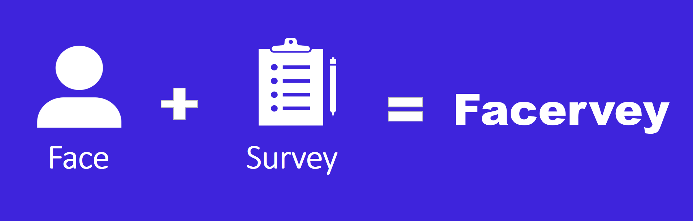
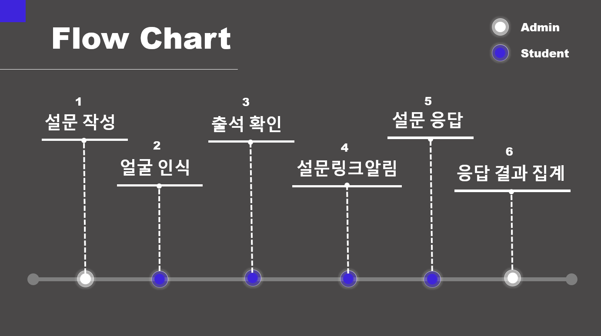
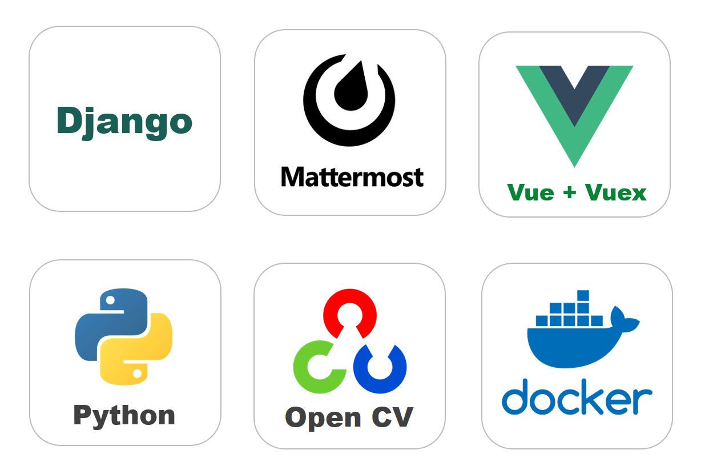

### section1
# 'Facervey'는 무슨 의미인가요?

 

>  **Face + survey**의 합성어로 얼굴인식과 설문조사를 동시에 진행한다는 의미를 가지고있습니다.

### section2

# 'Facervey' 기획 의도는 무엇인가요?

- __문제 인식__
  - SSAFY 측에서는 출석과 설문조사를 확인하지 못한 교육생들에게 일일이 요구하는 상황이  발생
  - 또한, 교육생들은 이를 잊고 소명을 작성하는 경우가 종종 있다.
- __해결방안__
  - 오프라인 학습의 경우, 카메라의 영상처리를 통해 교육생을 알아내고 자동으로 출석체크를 수행한다.
  - 또한 이 교육생들에게 자동으로 설문조사 Form을 보내주어 설문을 수행하게 돕는다.
- __기대효과__
  - 운영프로님들의 입장에선 수동적으로 교육생에게 설문과 출석을 요구할 필요가 없다.
  - 교육생입장에서는 출석에서 설문으로 접속과정을 생략하여 수행할 수 있다.

### section3

# 어떤 방식으로 동작하나요?

- IoT 제품으로 선택된 라즈베리파이에서 실시간으로 영상을 AWS의 Docker로 배포된 서버에 전송한다.
- 수신한 서버에서는 영상처리 알고리즘으로 사람의 얼굴과 그 사람이 누구인지 판별한다.
  - 여기서, 판별의 기준은 미리 저장한 사진을 기준으로 학습시킨 데이터모델링을 기반으로 수행한다.
  - 또한 face detection 모델은 opencv에서 제공하는 모델링 모듈을 사용한다.
- 판별된 사람을 기준으로 자동 출석처리를 수행하고, MatterMost DM massage로 설문조사 링크를 송신한다.
  - 배포된 서버에서 관리자가 미리 출석처리와 설문조사 링크를 수신한 학생들을 등록할 수 있으며, 설문조사 Form을 만들 수 있다.
- 관리자는 서버에서 투표의 통계와 교육생들의 의견을 취합한 결과를 볼 수 있다.

### section4

# 어떤 기술을 사용했나요? (기술스택)

#### 

- __Djnago__
- __MatterMost__
- __Docker__
- __python__
- __Vue__
- __OpenCV__
- __Rasbian__ 

### section5

# 직접 사용해보세요!

http://i3b108.p.ssafy.io/

aws를 사용하여 배포하였습니다.

테스트 계정

| usernam | email          | password   |
| ------- | -------------- | ---------- |
| test    | test@naver.com | test1234!! |

